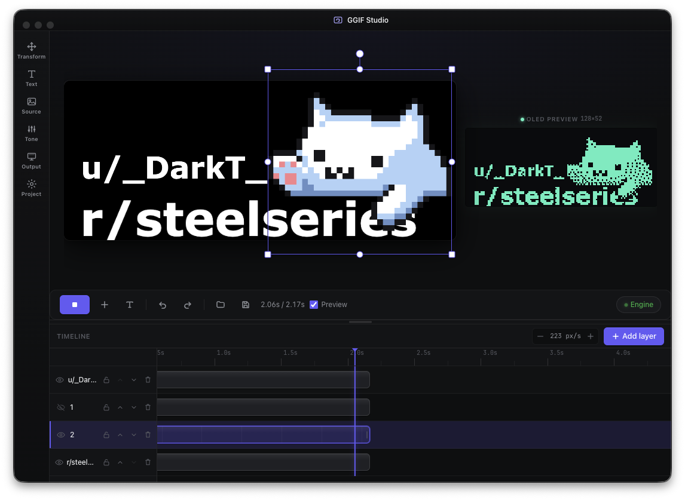

# GGIF Studio



Animate GIFs on the OLED screen of SteelSeries devices (built for the **Arctis Nova Pro Wireless** base station) via the [GameSense SDK](https://github.com/SteelSeries/gamesense-sdk).

Electron + TypeScript + React. No native dependencies → builds clean on Windows and macOS.

Studio UI: modern UI with multi-layers system and timeline to create your creative animated gifs

## Features

- **Sources:** GIF + video (mp4 / webm / mov / m4v). Video decoded in-renderer via
  `HTMLVideoElement` + `requestVideoFrameCallback`, sampled at a target fps (capped 600 frames).
- **Transform:** fit (contain/cover/stretch), rotate 0/90/180/270, flip H/V, zoom, offset X/Y.
- **Source handling:** transparent-background fill (black/white), **invert source** (pre-threshold —
  fixes black-on-transparent art that else renders blank).
- **Tone:** brightness, contrast, gamma, auto-contrast (normalize), threshold.
- **Output:** dither (Floyd–Steinberg / Atkinson / ordered Bayer / threshold / none), invert output.
- **Playback:** speed, min-frame clamp, trim in/out, loop, frame-step, scrub.

All decode + image processing + playback timing runs in the renderer; the main process only does
engine I/O (discover/register/sendFrame/heartbeat/stop) and window controls.

## How it works

1. Finds the running SteelSeries Engine by reading `coreProps.json` (the local HTTP address).
2. Registers a game `GGIF_Studio` and binds a `screen` handler for the chosen resolution.
3. Decodes the GIF (`gifuct-js`), composites frames honoring GIF disposal methods.
4. Per frame: resize (contain/cover/stretch) → grayscale → brightness/contrast/gamma → **Floyd–Steinberg / ordered / threshold** dither to 1-bit → pack MSB-first.
5. Pushes each frame to the engine via `game_event` using the `image-data-WIDTHxHEIGHT` context key, at the GIF's own frame delays. Sends a `game_heartbeat` every 8 s so the animation stays alive.

All image work runs in the main (Node) process; the renderer is pure UI and a live preview.

## Resolution

The doc shipped with the SDK predates the Nova Pro and lists `128x36/40/48/52`. The Nova Pro Wireless base station is **128x64** (default). If the screen stays black:

- Click **Test screen** — draws a border + cross + checkerboard. If you see it, the resolution is right.
- If not, try the other resolutions in the dropdown until the test pattern appears.

## Requirements

- SteelSeries GG / Engine running.
- Node 18+ (for `dev`/build only — the packaged app bundles its own runtime).

## Run

```bash
npm install
npm run dev          # hot-reload dev
```

## Build installers

```bash
npm run pack:mac     # .dmg
npm run pack:win     # .exe (NSIS)
npm run pack:all     # both (host toolchain permitting)
```

Output in `release/`.

## Notes

- “GameSense plugin” = just a local app talking HTTP to the engine; there is no sandboxed plugin format. This app is that client.
- Frame data is `⌈w*h/8⌉` bytes, 1 bit/pixel, white = 1, MSB-first, row-major. Width 128 is byte-aligned so rows need no padding.
